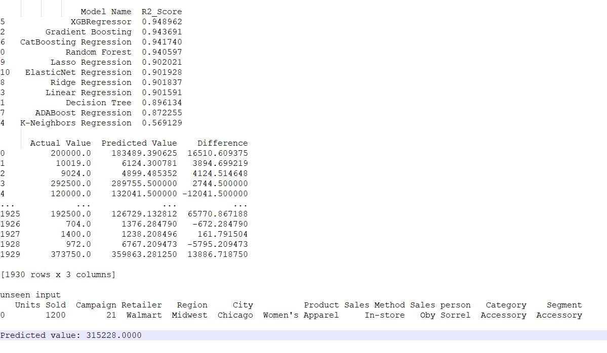

# addidas_ml_sales_project

This machine language project (ML) uses an Addidas sales dataset to predict total sales.
The dataset consists of 17 column and 9648 rows.

Exploratory data analysis was done in Jupyter notebook (included)

The ML project evaluated the below Linear models using the datasets and select the best models for predict on unseen data

The output:

